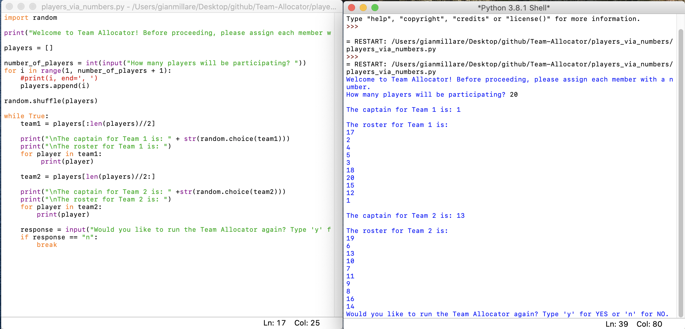

# Team-Allocator
 

Difficulty: Easy

This mini-project is from "Beginner's Step-by-Step Coding Course", written by DK Pub. This is a continuation of my career in software development and programming, following my graduation and certification from UC Berkeley's Data Analytics Extension Program. Although the difficulty of this project is rated beginner/easy, I felt that this project can help hone some of the fundamentals of programming in Python.
 
---------------------------------------------------------------------------------------------------------
Splitting group into two teams and choosing the team captains

 
---------------------------------------------------------------------------------------------------------
Splitting group into three teams and choosing the team captains

 
---------------------------------------------------------------------------------------------------------
Assigning the group numbers and splitting those numbers into two teams

 
---------------------------------------------------------------------------------------------------------
Giving the user an option between team vs. team or player vs. player

